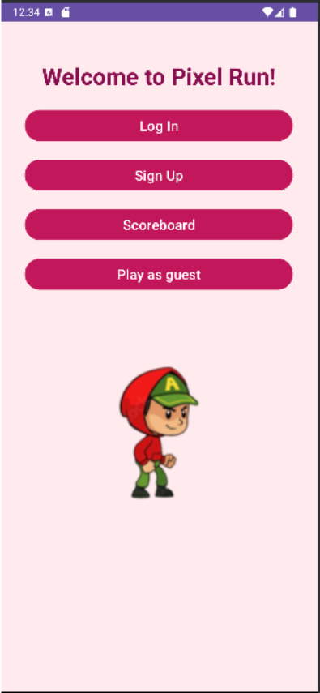
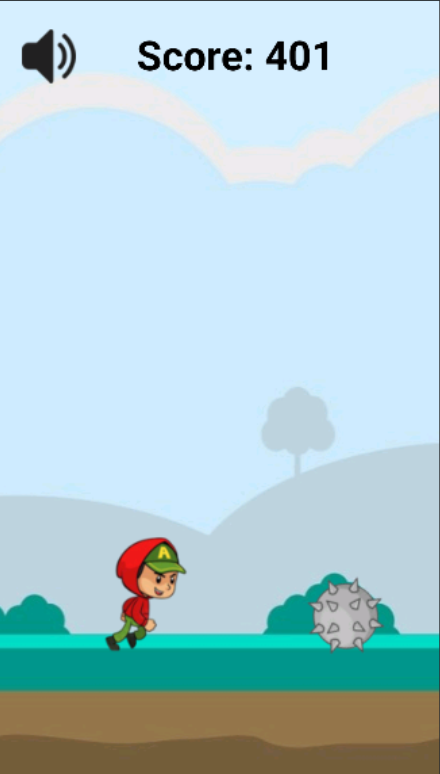
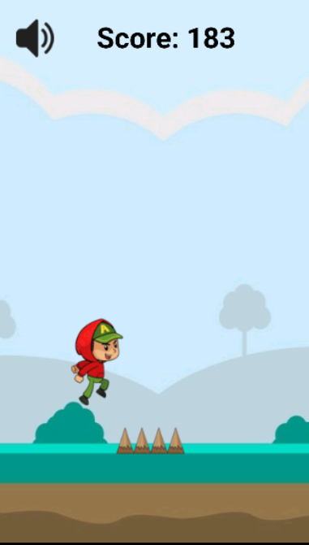
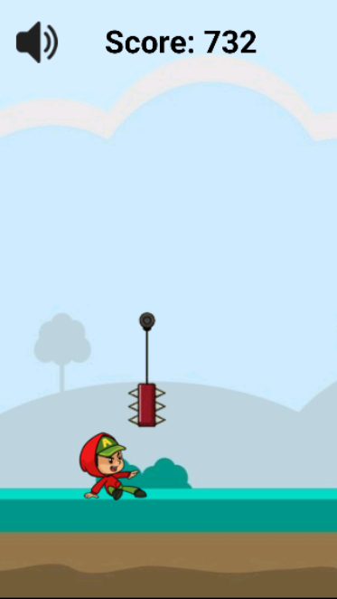

# 
PixelRun is a 2D side-scrolling runner game developed in Java.  
Your mission: survive by jumping and sliding below incoming obstacles for as long as you can. The game includes real-time animation, background music, and a global Firebase-based leaderboard.

---

## 🎮 Features

- 🎮 Real-time gameplay using `SurfaceView` and custom animation loop
- 🧠 Obstacle logic with random different obstacles
- 🎵 Background music via `Service`, continuing across activity lifecycle
- 🔒 User login and authentication with Firebase Auth
- ☁️ Global leaderboard using Firebase Realtime Database
- 🧪 Fully object-oriented code with inheritance

---

## 📸 Screenshots

  
  
  
  
  
  
  
  

---

## 🛠 Tech Stack

| Tech | Description |
|------|-------------|
| **Java** | Core language |
| **Android SDK** | Platform APIs |
| **SurfaceView** | Custom rendering for real-time animation |
| **Firebase Auth** | User sign-in and authentication |
| **Firebase Realtime DB** | Storing leaderboard and scores |
| **Threads** | Game loop & obstacle handling |
| **OOP Principles** | Classes for game entities |
